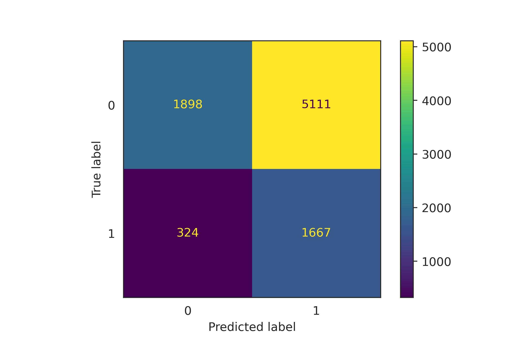

# Credible or not Credible Clients - Default of Credit Card

From a bank’s perspective, one of the most important piece of information about clients is
how willing are they to default? In possession of this banks can set credit limits as well
as interest rates that clients must bear. In addition, it’s fundamental piece to calculate
contingent liabilities on the balance sheet.

## Key Takeaways

1. Default in the previous month is the most important feature to explain customer default, the credit limit also has predictive power, but the relationship is inverse; 
2. The importance of gender, age and marriage is secundary compared tow history of payment and credit limit.

### Brief data description

The dataset contains 23 numerical attributes and a binary variable on default credit card payment. There are 30,000 observations, each observation represent one customer record. Finally, the dataset is unbalanced.

## Models

The F1 score was set to evaluate the model for two reasons: (1) It is a well-balanced score that assesses accuracy and recall equally, and since we are interested in a well-balanced
model, it is naturally a good indicator. (2) Since the dataset is unbalanced, accuracy is no longer a good measure of adequacy.

First I tried two ensemble models based on trees because it has no cost to scale and centralize the data. I used `GridSearchCV` to tune the best `RandomForestClassifier` against the best `ExtraTreesClassifier`. These Classifiers have set the baseline score.

Secondly I scaled the data and tried others estimators, I also tried a `VotingClassifier` with `LinearSVC`, `LogisticRegression` and `KNeighborsClassifier`, but at the end no one could bet the `ExtraTreeClassifier`. 

Finally, I presented the confusion matrix for the winner classifier. As can be seen, the result is just ok, but should be improved. Two possibilities (1) More data, mainly other social features such as employment, may be helpful. (2) More complex model. 

## Reproducibility

DVC pipelines, CML and GitHub actions to track and reproduce the final model.

Find out more in the [report!](./report/report.pdf)
